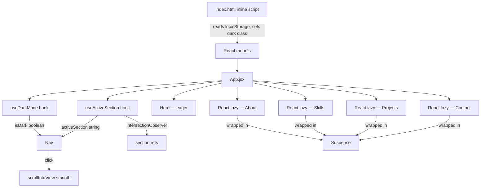

# Design Document: Personal Portfolio Website

## Overview

This document describes the technical design for Kent Schaeffer's personal portfolio website — a static React + Tailwind CSS single-page application with the "Pacific Engineering" aesthetic. The site deploys to GitHub Pages via Vite and `gh-pages`, requires no backend, and features dark mode, smooth-scroll navigation, mobile-first responsive layout, and lazy-loaded sections.

### Key Research Findings

- **Tailwind dark mode**: `darkMode: 'class'` strategy in `tailwind.config.js` allows toggling the `dark` class on `<html>` for full manual control, composing cleanly with CSS custom properties. [Tailwind Docs](https://tailwindcss.com/docs/dark-mode)
- **Property-based testing**: `fast-check` with `@fast-check/vitest` integration is the standard PBT approach for Vite/Vitest projects. It extends Vitest's `test`/`it` with `fc.test`/`fc.it` and supports minimum 100 iterations per property. [fast-check](https://fast-check.dev/)
- **Flicker-free dark mode**: An inline `<script>` in `index.html` that synchronously reads `localStorage` before React mounts is the canonical pattern for avoiding the light-flash-then-dark repaint.
- **Vite + GitHub Pages**: Setting `base` in `vite.config.js` to the repo subdirectory path and using hash-based navigation (`/#section`) eliminates the need for 404 redirect hacks.
- **Self-hosted fonts via Fontsource**: The `@fontsource` npm ecosystem packages open-source fonts (OFL-1.1) as npm dependencies, bundled directly by Vite. Fonts are served from the same origin with no external DNS lookups, no privacy concerns, and no dependency on Google's infrastructure. [fontsource.org](https://fontsource.org)
- **Lucide React icons**: `lucide-react` (ISC license) provides a community-maintained, fully open-source SVG icon set as individual React components. Vite tree-shakes unused icons at build time, so only imported icons appear in the final bundle. [lucide.dev](https://lucide.dev)

---

## Architecture

### Technology Stack

| Concern | Choice | Rationale |
|---|---|---|
| Framework | React 18 | Hooks API, concurrent features, ecosystem |
| Build tool | Vite 5 | Fast HMR, native ESM, optimal static output |
| Styling | Tailwind CSS v3 + CSS custom properties | Utility-first + semantic color tokens |
| Fonts | Fraunces, DM Sans, JetBrains Mono via `@fontsource` npm packages (OFL-1.1) | Self-hosted, no external CDN, fully open-source |
| Icons | `lucide-react` (ISC license) | Open-source, tree-shakeable SVG React components |
| Testing | Vitest + @testing-library/react | Native Vite integration |
| PBT | fast-check + @fast-check/vitest | Industry-standard JS PBT library |
| Deployment | gh-pages + Vite static build | Zero-cost GitHub Pages hosting |
| Dark mode | Tailwind `darkMode: 'class'` + `useDarkMode` hook | Manual control + localStorage persistence |
| Navigation | Hash anchors (`/#section`) + `scrollIntoView` | No React Router needed for single-page |

### Open-Source Dependency Inventory

All external assets and libraries are fully open-source, self-hosted via npm, and serve from the same origin. No requests are made to Google, Adobe, or any third-party CDN at runtime.

| Asset | npm package | License | Replaces |
|---|---|---|---|
| Fraunces display font | `@fontsource/fraunces` | OFL-1.1 | Google Fonts CDN |
| DM Sans body font | `@fontsource-variable/dm-sans` | OFL-1.1 | Google Fonts CDN |
| JetBrains Mono code font | `@fontsource/jetbrains-mono` | OFL-1.1 | Google Fonts CDN / JetBrains CDN |
| Sun / Moon / Menu / X / Github / Linkedin icons | `lucide-react` | ISC | Any proprietary icon set |

**Key benefits of this approach:**
- Fonts are bundled by Vite into the `dist/` output — no DNS lookup latency on first paint
- No GDPR-sensitive third-party font requests (Google Fonts logs IP addresses)
- `lucide-react` icons are pure SVG React components — no icon font, no sprite sheet, no CDN
- All licenses (OFL-1.1, ISC) permit free use, modification, and redistribution

### High-Level Data Flow



### Rendering Strategy

- **Hero + Nav**: Eagerly loaded — they are above-the-fold on every device.
- **About, Skills, Projects, Contact**: `React.lazy()` + `<Suspense>` — reduces initial bundle by deferring components the user may never scroll to. Each lazy chunk is a separate Vite code-split boundary.
- **Fonts**: Imported directly in `src/styles/index.css` from `@fontsource` npm packages — fonts are bundled with the app and served from the same origin. No external CDN requests, no `<link>` tags pointing to Google Fonts or any third-party host. This improves privacy, load reliability, and eliminates GDPR concerns around third-party font CDNs.
- **Icons**: `lucide-react` components are tree-shaken by Vite — only the specific icons imported (e.g., `Sun`, `Moon`, `Menu`, `X`, `Github`, `Linkedin`) are included in the final bundle. No icon font sprite sheets or CDN-hosted SVGs.

---

## Components and Interfaces

### Component Tree

```
src/
  App.jsx                      # Root: applies dark class, composes Nav + sections
  hooks/
    useDarkMode.js             # Dark mode state + versioned localStorage
    useActiveSection.js        # IntersectionObserver-based active section tracker
  components/
    Nav/
      Nav.jsx                  # Fixed nav, hamburger state, dark toggle
      navLinks.js              # Module-level nav link config (labels + hash hrefs)
    sections/
      Hero.jsx                 # Eager-loaded hero banner
      About.jsx                # Lazy-loaded about section
      Skills.jsx               # Lazy-loaded skills section
      Projects.jsx             # Lazy-loaded projects section
      Contact.jsx              # Lazy-loaded contact section
    ui/
      SkillBadge.jsx           # Reusable badge for a single skill
      ProjectCard.jsx          # Reusable card for a single project
      DarkModeToggle.jsx       # Sun/moon icon toggle button
      SectionWrapper.jsx       # IntersectionObserver fade-up animation wrapper
  data/
    skills.js                  # Module-level skills data (categories + items)
    projects.js                # Module-level project placeholder data
  styles/
    index.css                  # Tailwind directives + CSS custom props + keyframes
  index.html                   # Inline script for flicker-free dark init
```

### Component Interfaces

#### `App.jsx`
```jsx
// No props — root of the component tree
// Reads isDark from useDarkMode, applies 'dark' class to <html>
// Renders Nav eagerly; wraps lazy sections in <Suspense fallback={<div />}>
export default function App()
```

#### `useDarkMode.js`
```js
// Returns [isDark: boolean, toggleDark: () => void]
// Lazy useState initializer: reads 'portfolio-theme-v1' from localStorage once at init
// Falls back to window.matchMedia('(prefers-color-scheme: dark)').matches
// Persists to localStorage on every toggle
export function useDarkMode(): [boolean, () => void]
```

#### `useActiveSection.js`
```js
// Returns activeSection: string (e.g. 'home', 'about', 'skills', ...)
// Uses IntersectionObserver stored in a ref — only calls setState when
// active section actually changes (avoids unnecessary re-renders)
// Observes all section elements via their id attributes
export function useActiveSection(sectionIds: string[]): string
```

#### `Nav.jsx`
```jsx
// Props: { isDark: boolean, toggleDark: () => void, activeSection: string }
// Internal state: isMenuOpen (boolean) for hamburger
// Renders navLinks array (from navLinks.js) — never re-creates array inside component
// Uses useCallback for handleLinkClick and handleToggle
// Hamburger/close icons from lucide-react: import { Menu, X } from 'lucide-react'
// GitHub/LinkedIn icons in Contact are from lucide-react: import { Github, Linkedin } from 'lucide-react'
export default function Nav({ isDark, toggleDark, activeSection })
```

#### `navLinks.js` (module-level constant)
```js
// Defined at module scope — never re-created per render
export const NAV_LINKS = [
  { label: 'Home',     href: '#home'     },
  { label: 'About',    href: '#about'    },
  { label: 'Skills',   href: '#skills'   },
  { label: 'Projects', href: '#projects' },
  { label: 'Contact',  href: '#contact'  },
]
```

#### `SectionWrapper.jsx`
```jsx
// Props: { id: string, children: ReactNode, className?: string }
// Attaches IntersectionObserver to its root div
// Adds 'is-visible' CSS class when section enters viewport (triggers fade-up)
// scroll-margin-top: 4rem applied via Tailwind class (matches nav height)
export default function SectionWrapper({ id, children, className })
```

#### `SkillBadge.jsx`
```jsx
// Props: { name: string, mono?: boolean }
// Renders skill name in JetBrains Mono; scale + bg transition on hover
// mono=true applies monospace font class
export default function SkillBadge({ name, mono })
```

#### `ProjectCard.jsx`
```jsx
// Props: { title: string, description: string, tags: string[], comingSoon?: boolean }
// Renders card with gradient top border (accent color)
// Lift effect on hover (translateY + box-shadow transition)
// Always displays "Coming Soon" badge per requirements
export default function ProjectCard({ title, description, tags, comingSoon })
```

#### `DarkModeToggle.jsx`
```jsx
// Props: { isDark: boolean, onToggle: () => void }
// Renders Sun icon (light mode) or Moon icon (dark mode) from lucide-react (ISC license)
// import { Sun, Moon } from 'lucide-react'
// Only these two icons are imported — Vite tree-shakes the rest of lucide-react
// Smooth rotate transition on icon swap via CSS transition on the wrapper
// aria-label="Toggle dark mode"
export default function DarkModeToggle({ isDark, onToggle })
```

#### `skills.js` (module-level constant)
```js
// Defined at module scope — never re-created per render
export const SKILLS = [
  {
    category: 'Technical Skills',
    items: ['DDI', 'Node.js', 'Perl', 'Shell Scripting', 'HTML/CSS', 'JavaScript', 'CLI Tools', 'Infoblox'],
  },
  {
    category: 'Tools & Platforms',
    items: ['Customer Service', 'Documentation', 'Confluence', 'Visio'],
  },
]
```

#### `projects.js` (module-level constant)
```js
// Defined at module scope — never re-created per render
export const PROJECTS = [
  {
    title: 'Project Alpha',
    description: 'A placeholder project showcasing backend automation and scripting capabilities.',
    tags: ['Node.js', 'Shell', 'CLI'],
    comingSoon: true,
  },
  {
    title: 'Project Beta',
    description: 'A placeholder project demonstrating network configuration and DDI management.',
    tags: ['DDI', 'Infoblox', 'Python'],
    comingSoon: true,
  },
  {
    title: 'Project Gamma',
    description: 'A placeholder project illustrating documentation and process engineering workflows.',
    tags: ['Confluence', 'Visio'],
    comingSoon: true,
  },
]
```

---

## Data Models

### Theme Preference

```ts
type ThemePreference = 'light' | 'dark'

// localStorage key (versioned to avoid stale values)
const THEME_KEY = 'portfolio-theme-v1'

// Runtime state
interface DarkModeState {
  isDark: boolean          // current active theme
  toggleDark: () => void   // flip isDark, persist to localStorage
}
```

### Nav Link

```ts
interface NavLink {
  label: string   // display text: 'Home' | 'About' | 'Skills' | 'Projects' | 'Contact'
  href: string    // hash anchor: '#home' | '#about' | '#skills' | '#projects' | '#contact'
}
```

### Skill Category

```ts
interface SkillCategory {
  category: string   // 'Technical Skills' | 'Tools & Platforms'
  items: string[]    // skill names — each appears in exactly one category
}

// Invariant: union of all items across all categories = full 12-skill set,
//            intersection of any two categories = empty set
```

### Project Card

```ts
interface Project {
  title: string         // placeholder project title
  description: string   // 1–2 sentence placeholder description
  tags: string[]        // 1–5 technology tag strings
  comingSoon: boolean   // always true for placeholder cards
}
```

### Active Section

```ts
type SectionId = 'home' | 'about' | 'skills' | 'projects' | 'contact'

// useActiveSection returns a single SectionId at any time.
// Invariant: exactly one section is active at any scroll position.
```

---

## Correctness Properties

*A property is a characteristic or behavior that should hold true across all valid executions of a system — essentially, a formal statement about what the system should do. Properties serve as the bridge between human-readable specifications and machine-verifiable correctness guarantees.*

This feature uses `fast-check` with `@fast-check/vitest` for property-based testing. Each property test runs a minimum of 100 iterations with randomly generated inputs. Tests are tagged with the format: `Feature: personal-portfolio-website, Property N: <text>`.

### Property 1: Active Section Exclusivity

*For any* set of section bounding rectangles and any scroll position, the active section detection logic SHALL return exactly one active section ID — never zero and never more than one.

**Validates: Requirements 1.8**

**Rationale**: Generated from the active section tracking logic in `useActiveSection`. The function is pure enough to extract: given a list of `{id, top, bottom}` rectangles and a `scrollY` value, it should always return exactly one match. Testing with random bounding box configurations and scroll positions will catch off-by-one errors in viewport intersection logic.

---

### Property 2: Dark Mode Toggle Idempotence

*For any* initial dark mode state (true or false), toggling the dark mode switch exactly twice SHALL return the state to its original value.

**Validates: Requirements 2.2, 2.3**

**Rationale**: This is a round-trip property on a boolean toggle. Generated from requirements 2.2 and 2.3 — activating then deactivating must restore original state. Fast-check generates both `true` and `false` initial states.

---

### Property 3: WCAG AA Contrast in Both Modes

*For any* text/background color token pair defined in the design system (light or dark mode), the computed relative luminance contrast ratio SHALL be ≥ 4.5:1 for normal text and ≥ 3:1 for large text (≥ 18pt or ≥ 14pt bold).

**Validates: Requirements 2.4**

**Rationale**: The color palette is fixed, but this property enumerates all defined `(text, background)` pairs in both modes and asserts the W3C contrast formula holds. Fast-check generates pairings from the defined token set. Any future palette change will immediately surface contrast failures.

**Color pairs to verify (light mode)**:
- `--color-text` (#1C1917) on `--color-bg` (#F7F4EF)
- `--color-text` (#1C1917) on `--color-surface` (#FFFFFF)
- `--color-primary` (#1B4F72) on `--color-bg` (#F7F4EF)
- `--color-muted` (#6B6560) on `--color-bg` (#F7F4EF)
- `--color-accent` (#D4A017) on `--color-bg` (#F7F4EF) — large text only (3:1)

**Color pairs to verify (dark mode)**:
- `--color-text` (#F0EDE8) on `--color-bg` (#0F1923)
- `--color-text` (#F0EDE8) on `--color-surface` (#1A2535)
- `--color-primary` (#5B9BD5) on `--color-bg` (#0F1923)
- `--color-muted` (#8A9AB0) on `--color-bg` (#0F1923)
- `--color-accent` (#E8B84B) on `--color-bg` (#0F1923) — large text only (3:1)

---

### Property 4: localStorage Theme Round-Trip

*For any* valid theme preference value (`'light'` or `'dark'`), writing it to `localStorage` under the key `'portfolio-theme-v1'` and reading it back SHALL return the identical value.

**Validates: Requirements 2.6**

**Rationale**: The `useDarkMode` hook's persistence layer must correctly serialize and deserialize the preference. Fast-check generates both valid values plus edge cases (empty string, null, corrupt JSON) to verify graceful fallback behavior.

---

### Property 5: Skills Rendering Completeness and Category Partitioning

*For any* permutation of the 12 defined skills across the two categories, the rendered Skills section SHALL display each skill name exactly once, and each skill SHALL appear in exactly one category group — the category groups SHALL be disjoint and their union SHALL equal the complete skills set.

**Validates: Requirements 5.2, 5.3**

**Rationale**: Combines two related properties into one comprehensive check. Fast-check generates permutations of skills assignments to verify the rendering function and data structure maintain the partition invariant. This catches bugs like duplicated badges or miscategorized skills.

---

### Property 6: Project Card Count Matches Data

*For any* projects data array of length N (1 ≤ N ≤ 10), the rendered Projects section SHALL contain exactly N project card elements in the DOM.

**Validates: Requirements 6.2**

**Rationale**: The `Projects.jsx` component maps over the `PROJECTS` array. This property verifies that the rendered count always equals the data length — no cards are dropped, duplicated, or conditionally hidden. Fast-check generates arrays of varying length.

---

### Property 7: Project Card Renders All Required Fields

*For any* valid `Project` data object (with non-empty title, description, tags array of 1–5 items), the rendered `ProjectCard` component SHALL include the title text, description text, all tag strings, and the "Coming Soon" label — all visible in the DOM.

**Validates: Requirements 6.3, 6.4**

**Rationale**: The `ProjectCard` render function is a pure transformation from a `Project` object to DOM output. Fast-check generates random project objects and asserts all required fields appear in the output. This catches missing template bindings and conditional rendering bugs.

---

## Error Handling

### Dark Mode Initialization Failures

| Failure | Behavior |
|---|---|
| `localStorage` read throws (e.g., Safari private browsing) | `useDarkMode` catches the error in the lazy initializer and falls back to `window.matchMedia('(prefers-color-scheme: dark)').matches` |
| `localStorage` value is corrupt / unrecognized string | Treat as missing; apply OS preference fallback |
| `window.matchMedia` unavailable (SSR / old browser) | Default to light mode (`isDark = false`) |
| Inline `<script>` in `index.html` throws | Script is wrapped in try/catch; failure silently passes (React will re-apply correct class on mount) |

### Lazy Loading Failures

| Failure | Behavior |
|---|---|
| Network error on lazy chunk fetch | `<Suspense>` boundary renders fallback (`<div aria-busy="true">`) until retry succeeds |
| Component throws during render | Each lazy section is wrapped in its own `<Suspense>` so a single section failure does not unmount the entire page |

### Navigation Edge Cases

| Scenario | Behavior |
|---|---|
| Target section element not found in DOM | `scrollIntoView` call is guarded with a null-check; navigation fails silently without throwing |
| Rapid consecutive link clicks | `scrollIntoView` calls are not debounced (browser handles gracefully); hamburger menu closes immediately on first click |
| Hash in URL on page load | On mount, `App.jsx` reads `window.location.hash` and calls `scrollIntoView` on the matching section, respecting the nav offset |

### Contact Link Security

- All external links enforce `target="_blank"` + `rel="noopener noreferrer"` to prevent tab-napping.
- URLs are hardcoded constants (not user-supplied), so no sanitization is required.

---

## Testing Strategy

### Overview

The testing approach combines example-based unit tests for specific behaviors and property-based tests for universal invariants. Property tests use `fast-check` (via `@fast-check/vitest`) with a minimum of 100 iterations each.

**Rule**: avoid writing exhaustive unit tests for every permutation — property tests handle broad input coverage. Unit tests focus on concrete examples, integration points, and edge cases.

### Test File Structure

```
src/
  __tests__/
    unit/
      Nav.test.jsx              # Nav rendering, hamburger toggle, link labels
      Hero.test.jsx             # Hero content, CTA button
      About.test.jsx            # About content rendering
      Contact.test.jsx          # Link hrefs, rel attributes
      DarkModeToggle.test.jsx   # Toggle button rendering
      ProjectCard.test.jsx      # Card field rendering (example-based)
      SkillBadge.test.jsx       # Badge rendering
    property/
      darkMode.property.test.js        # P2: toggle idempotence; P4: localStorage round-trip
      contrast.property.test.js        # P3: WCAG AA color contrast
      activeSection.property.test.js   # P1: active section exclusivity
      skills.property.test.jsx         # P5: skills completeness + partition
      projects.property.test.jsx       # P6: card count; P7: card field rendering
    smoke/
      config.test.js            # vite.config.js base option, package.json deploy script
```

### Property Test Configuration

Each property test file follows this pattern:

```js
import { test, expect } from 'vitest'
import * as fc from 'fast-check'

// Feature: personal-portfolio-website, Property 2: dark mode toggle idempotence
test('dark mode toggle is idempotent', () => {
  fc.assert(
    fc.property(fc.boolean(), (initialState) => {
      const state1 = !initialState   // toggle once
      const state2 = !state1         // toggle twice
      expect(state2).toBe(initialState)
    }),
    { numRuns: 100 }
  )
})
```

### Unit Test Priorities

**High priority** (concrete, specific):
- Nav renders all 5 link labels
- Nav link click triggers `scrollIntoView` on correct element
- Hamburger opens/closes menu on mobile
- Hero renders `h1` with "Kent Schaeffer", subtitle, business name, CTA button
- Hero `img` placeholder has correct `alt` attribute
- Contact links have `target="_blank"` and `rel="noopener noreferrer"`
- `useDarkMode` falls back to OS preference when localStorage is unavailable

**Integration tests**:
- Dark class applied to `<html>` on toggle activation
- `App.jsx` renders Nav + all five section wrappers
- Scroll offset from nav height applied to sections (via `scroll-margin-top`)

**Smoke tests**:
- `vite.config.js` exports a config with a non-root `base` property
- `package.json` includes a `deploy` script referencing `gh-pages`

### Accessibility Testing

Manual testing checklist (not automated):
- All interactive elements have visible focus rings (accent color outline)
- Hamburger button: `aria-label="Open navigation menu"` / `aria-expanded` toggled
- Screen reader passes: Nav landmarks (`<nav>`), section headings hierarchy (`h1` > `h2`)
- Skill badges and Nav links tested with axe DevTools for contrast

### Visual Regression

- Not included in this spec phase
- Recommended future addition: Playwright visual snapshots for Hero layout and dark mode state

---

## Layout and Visual Design

### Color System (CSS Custom Properties)

Defined in `src/styles/index.css`, consumed via Tailwind's `theme.extend.colors`:

```css
/* Light mode (default) */
:root {
  --color-bg:      #F7F4EF;
  --color-surface: #FFFFFF;
  --color-primary: #1B4F72;
  --color-accent:  #D4A017;
  --color-text:    #1C1917;
  --color-muted:   #6B6560;
}

/* Dark mode */
.dark {
  --color-bg:      #0F1923;
  --color-surface: #1A2535;
  --color-primary: #5B9BD5;
  --color-accent:  #E8B84B;
  --color-text:    #F0EDE8;
  --color-muted:   #8A9AB0;
}
```

### Typography Scale

| Role | Font | npm package | License | Tailwind class |
|---|---|---|---|---|
| Display / h1–h2 | Fraunces | `@fontsource/fraunces` | OFL-1.1 | `font-display` |
| Body / UI | DM Sans | `@fontsource-variable/dm-sans` | OFL-1.1 | `font-body` |
| Code / skill badges | JetBrains Mono | `@fontsource/jetbrains-mono` | OFL-1.1 | `font-mono` |

Fonts are imported once in `src/styles/index.css`:
```css
@import '@fontsource/fraunces/400.css';
@import '@fontsource/fraunces/700.css';
@import '@fontsource-variable/dm-sans';
@import '@fontsource/jetbrains-mono/400.css';
```

No Google Fonts CDN URLs, no `<link rel="stylesheet">` to external origins. All font files are bundled by Vite and served from the same domain.

### Section Layout Patterns

| Section | Mobile | Tablet (≥768px) | Desktop (≥1024px) |
|---|---|---|---|
| Nav | Collapsed hamburger | Full inline links | Full inline links |
| Hero | Single column, stacked | Two-column (text 60% / photo 40%) | Two-column, max-width container |
| About | Single column | Two-column with decorative vertical rule | Two-column, stat callout block |
| Skills | 2-column badge grid | 3-column badge grid | 4-column badge grid |
| Projects | 1-column card stack | 2-column grid | 3-column grid |
| Contact | Centered, single column | Centered, single column | Centered, max-width |

### Scroll and Navigation

```css
/* Applied to every section via SectionWrapper */
section {
  scroll-margin-top: 4rem; /* matches nav height */
}
```

Smooth scroll triggered by:
```js
document.getElementById(sectionId).scrollIntoView({
  behavior: 'smooth',
  block: 'start',
})
```

### Motion and Animations (CSS only, no JS animation library)

```css
/* Section entrance: fade-up on IntersectionObserver trigger */
.section-enter {
  opacity: 0;
  transform: translateY(24px);
  transition: opacity 500ms ease, transform 500ms ease;
}
.section-enter.is-visible {
  opacity: 1;
  transform: translateY(0);
}

/* Hero staggered fade-up */
@keyframes fadeUp {
  from { opacity: 0; transform: translateY(20px); }
  to   { opacity: 1; transform: translateY(0);    }
}
.hero-name    { animation: fadeUp 600ms ease both; animation-delay: 0ms;   }
.hero-title   { animation: fadeUp 600ms ease both; animation-delay: 150ms; }
.hero-biz     { animation: fadeUp 600ms ease both; animation-delay: 300ms; }
.hero-photo   { animation: fadeUp 600ms ease both; animation-delay: 450ms; }
.hero-cta     { animation: fadeUp 600ms ease both; animation-delay: 600ms; }

/* Skill badge hover */
.skill-badge:hover {
  transform: scale(1.05);
  transition: transform 150ms ease, background-color 150ms ease;
}

/* Project card hover lift */
.project-card:hover {
  transform: translateY(-4px);
  box-shadow: 0 8px 24px rgba(0,0,0,0.15);
  transition: transform 200ms ease, box-shadow 200ms ease;
}

/* CTA button hover pulse */
.cta-button:hover {
  outline-offset: 4px;
  transition: outline-offset 200ms ease;
}
```

### Nav Frosted Glass

```css
nav {
  backdrop-filter: blur(12px);
  background-color: rgba(247, 244, 239, 0.85); /* light mode */
}
.dark nav {
  background-color: rgba(15, 25, 35, 0.85);    /* dark mode */
}
```

### Flicker-Free Dark Mode Init (index.html)

```html
<script>
  (function () {
    try {
      var stored = localStorage.getItem('portfolio-theme-v1');
      if (stored === 'dark' || (!stored && window.matchMedia('(prefers-color-scheme: dark)').matches)) {
        document.documentElement.classList.add('dark');
      }
    } catch (e) {
      // localStorage unavailable — default to light mode
    }
  })();
</script>
```

### Vite Configuration

```js
// vite.config.js
import { defineConfig } from 'vite'
import react from '@vitejs/plugin-react'

export default defineConfig({
  plugins: [react()],
  base: '/personal-portfolio-website/',  // matches GitHub Pages repo subdirectory
})
```

### Deployment Script (package.json)

```json
{
  "scripts": {
    "dev": "vite",
    "build": "vite build",
    "preview": "vite preview",
    "deploy": "vite build && gh-pages -d dist"
  }
}
```
