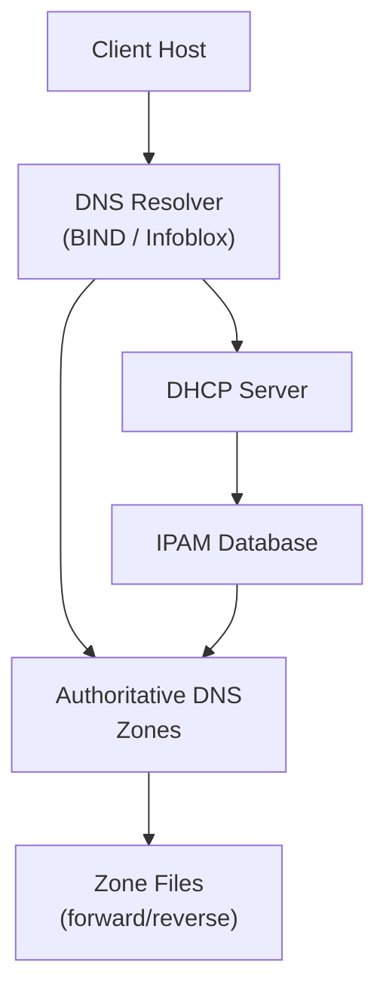

> **INTERNAL — Do not distribute externally.**

## Overview

{content}

## Requirements

### Functional Requirements

- [ ] DNS resolution for [ZONES]
- [ ] DHCP serving for [SCOPES]
- [ ] IPAM tracking for [NETWORKS]

### Non-Functional Requirements

- Availability: [TARGET, e.g. 99.9%]
- Response time: [e.g. < 5ms for DNS queries]
- Redundancy: [Primary/Secondary, HA config]

## Architecture Diagram



## Zone Design

| Zone Name | Type | Primary | Secondary | TTL |
| :--- | :--- | :--- | :--- | :--- |
| | | | | |

## DHCP Scopes

| Scope | Network | Range | Gateway | DNS |
| :--- | :--- | :--- | :--- | :--- |
| | | | | |

## IPAM Strategy

- **Address space:** [CIDR BLOCKS]
- **Allocation method:** [Static / Dynamic / Reserved]
- **Naming convention:** [HOSTNAME PATTERN]

## Implementation Notes

<!-- Vendor-specific config notes (Infoblox, QIP, BIND, Kea, etc.) -->

## Verification Tests

```bash
# DNS resolution test
dig @[RESOLVER_IP] [HOSTNAME] A

# Reverse lookup
dig @[RESOLVER_IP] -x [IP_ADDRESS]

# DHCP lease check
# [TOOL-SPECIFIC COMMAND]
```

## Change History

| Date | Version | Description | Author |
| :--- | :--- | :--- | :--- |
| | 1.0.0 | Initial draft | Kent Schaeffer |
