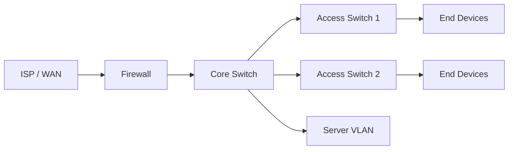
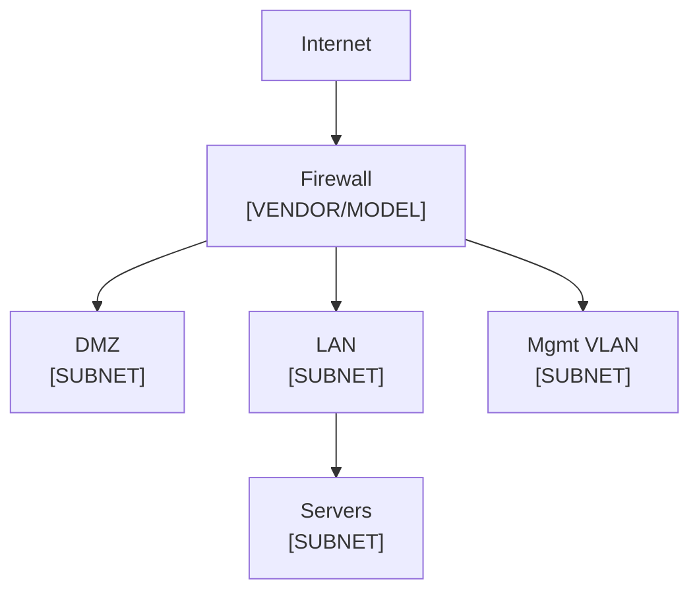

> **INTERNAL — Do not distribute externally.**

## Site Overview

{content}

**Site:** [SITE NAME / LOCATION]
**Environment:** [Production / Staging / Lab]
**Last physical review:** [DATE]

## Physical Topology

## Logical Topology

## VLAN Configuration

| VLAN ID | Name | Subnet | Gateway | Purpose |
| :--- | :--- | :--- | :--- | :--- |
| 1 | Default | | | Untagged (do not use) |
| 10 | Management | | | Network device mgmt |
| 20 | Servers | | | Production servers |
| 30 | Users | | | End user workstations |
| 40 | DMZ | | | Public-facing services |

## Device Inventory

| Hostname | Role | Model | IP | Location |
| :--- | :--- | :--- | :--- | :--- |
| | | | | |

## Routing

| Protocol | Purpose | Networks Advertised |
| :--- | :--- | :--- |
| Static | Default route | 0.0.0.0/0 → [GATEWAY] |
| | | |

## Firewall Rules Summary

| Rule | Source | Destination | Port/Protocol | Action |
| :--- | :--- | :--- | :--- | :--- |
| | | | | |

## Known Issues / Notes

<!-- Outstanding issues, temporary configs, things to fix. -->
