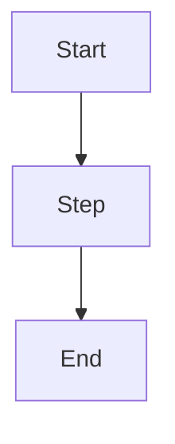

> **INTERNAL — Do not distribute externally.**

## Purpose

{content}

## Prerequisites

<!-- Tools, access, environment requirements. -->

## Architecture / Diagram

## Procedure

1. **Step 1** — Description
2. **Step 2** — Description
3. **Step 3** — Description

## Verification

<!-- How to confirm the procedure succeeded. -->

## Rollback

<!-- Steps to undo if something goes wrong. -->

## Notes

<!-- Edge cases, warnings, known issues. -->
